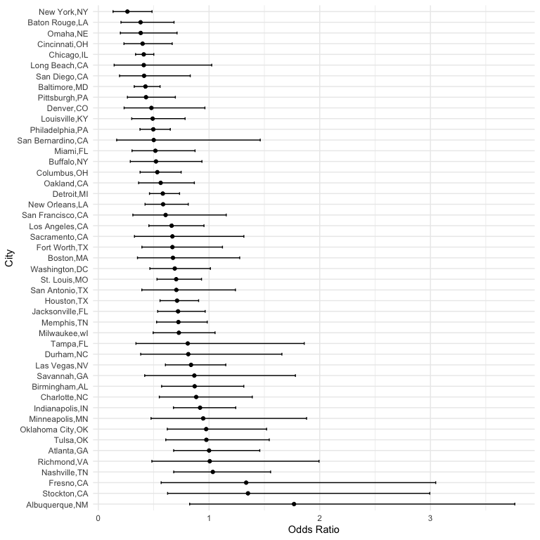

P8105 HW6
================
Kehan Su
2024-12-02

``` r
library(tidyverse)
library(p8105.datasets)
library(modelr)
library(mgcv)
library(SemiPar)
set.seed(1)
```

## Problem 1

``` r
#weather_df = 
#  rnoaa::meteo_pull_monitors(
#    c("USW00094728"),
#    var = c("PRCP", "TMIN", "TMAX"), 
#    date_min = "2017-01-01",
#    date_max = "2017-12-31") %>%
#  mutate(
#    name = recode(id, USW00094728 = "CentralPark_NY"),
#    tmin = tmin / 10,
#    tmax = tmax / 10) %>%
#  select(name, id, everything())
```

## Problem 2

``` r
url = "https://raw.githubusercontent.com/washingtonpost/data-homicides/master/homicide-data.csv"
homicide_data = read_csv(url)
```

    ## Rows: 52179 Columns: 12
    ## ── Column specification ────────────────────────────────────────────────────────
    ## Delimiter: ","
    ## chr (9): uid, victim_last, victim_first, victim_race, victim_age, victim_sex...
    ## dbl (3): reported_date, lat, lon
    ## 
    ## ℹ Use `spec()` to retrieve the full column specification for this data.
    ## ℹ Specify the column types or set `show_col_types = FALSE` to quiet this message.

``` r
homicide_df = 
  homicide_data |>
    mutate(
    city_state = paste(city, state, sep = ","),
    solved = ifelse(disposition == "Closed by arrest", 1, 0)
    ) |>
  filter(!(city_state %in% c("Dallas,TX","Phoenix,AZ","Kansas City,MO","Tulsa,AL"))) |>
  filter(victim_race %in% c("White","Black")) |>
  mutate(victim_age = as.numeric(victim_age))
```

``` r
# For Baltimore
baltimore_test = 
  homicide_df |>
  filter(city_state == "Baltimore,MD") |>
  glm(solved ~ victim_age + victim_sex + victim_race, family = "binomial", 
      data = _) |>
  broom::tidy(conf.int = TRUE, conf.level = 0.95) |>
  mutate(
    OR = exp(estimate),
    lower = exp(conf.low),
    upper = exp(conf.high)
  ) |>
  filter(term == "victim_sexMale") |>
  select(OR, lower, upper)
baltimore_test |>
  knitr::kable(digits = 3)
```

|    OR | lower | upper |
|------:|------:|------:|
| 0.426 | 0.324 | 0.558 |

``` r
# For each city
city_tests = 
  homicide_df |>
  group_by(city_state) |>
  nest() |>
  mutate(
    fit = map(
      data, ~ glm(solved ~ victim_age + victim_race + victim_sex, data = ., family = binomial())
      ),
    results = map(fit, ~ broom::tidy(.x, conf.int = TRUE, conf.level = 0.95))
  ) |>
  unnest(results) |>
  mutate(
    OR = exp(estimate),
    lower = exp(conf.low),
    upper = exp(conf.high)
  ) |>
  filter(term == "victim_sexMale") |>
  select(city_state, OR, lower, upper)
    
city_tests |>
  knitr::kable(digits = 3)
```

| city_state        |    OR | lower | upper |
|:------------------|------:|------:|------:|
| Albuquerque,NM    | 1.767 | 0.825 | 3.762 |
| Atlanta,GA        | 1.000 | 0.680 | 1.458 |
| Baltimore,MD      | 0.426 | 0.324 | 0.558 |
| Baton Rouge,LA    | 0.381 | 0.204 | 0.684 |
| Birmingham,AL     | 0.870 | 0.571 | 1.314 |
| Boston,MA         | 0.674 | 0.353 | 1.277 |
| Buffalo,NY        | 0.521 | 0.288 | 0.936 |
| Charlotte,NC      | 0.884 | 0.551 | 1.391 |
| Chicago,IL        | 0.410 | 0.336 | 0.501 |
| Cincinnati,OH     | 0.400 | 0.231 | 0.667 |
| Columbus,OH       | 0.532 | 0.377 | 0.748 |
| Denver,CO         | 0.479 | 0.233 | 0.962 |
| Detroit,MI        | 0.582 | 0.462 | 0.734 |
| Durham,NC         | 0.812 | 0.382 | 1.658 |
| Fort Worth,TX     | 0.669 | 0.394 | 1.121 |
| Fresno,CA         | 1.335 | 0.567 | 3.048 |
| Houston,TX        | 0.711 | 0.557 | 0.906 |
| Indianapolis,IN   | 0.919 | 0.678 | 1.241 |
| Jacksonville,FL   | 0.720 | 0.536 | 0.965 |
| Las Vegas,NV      | 0.837 | 0.606 | 1.151 |
| Long Beach,CA     | 0.410 | 0.143 | 1.024 |
| Los Angeles,CA    | 0.662 | 0.457 | 0.954 |
| Louisville,KY     | 0.491 | 0.301 | 0.784 |
| Memphis,TN        | 0.723 | 0.526 | 0.984 |
| Miami,FL          | 0.515 | 0.304 | 0.873 |
| Milwaukee,wI      | 0.727 | 0.495 | 1.054 |
| Minneapolis,MN    | 0.947 | 0.476 | 1.881 |
| Nashville,TN      | 1.034 | 0.681 | 1.556 |
| New Orleans,LA    | 0.585 | 0.422 | 0.812 |
| New York,NY       | 0.262 | 0.133 | 0.485 |
| Oakland,CA        | 0.563 | 0.364 | 0.867 |
| Oklahoma City,OK  | 0.974 | 0.623 | 1.520 |
| Omaha,NE          | 0.382 | 0.199 | 0.711 |
| Philadelphia,PA   | 0.496 | 0.376 | 0.650 |
| Pittsburgh,PA     | 0.431 | 0.263 | 0.696 |
| Richmond,VA       | 1.006 | 0.483 | 1.994 |
| San Antonio,TX    | 0.705 | 0.393 | 1.238 |
| Sacramento,CA     | 0.669 | 0.326 | 1.314 |
| Savannah,GA       | 0.867 | 0.419 | 1.780 |
| San Bernardino,CA | 0.500 | 0.166 | 1.462 |
| San Diego,CA      | 0.413 | 0.191 | 0.830 |
| San Francisco,CA  | 0.608 | 0.312 | 1.155 |
| St. Louis,MO      | 0.703 | 0.530 | 0.932 |
| Stockton,CA       | 1.352 | 0.626 | 2.994 |
| Tampa,FL          | 0.808 | 0.340 | 1.860 |
| Tulsa,OK          | 0.976 | 0.609 | 1.544 |
| Washington,DC     | 0.690 | 0.465 | 1.012 |

``` r
# Plot showing the estimated ORs and CIs
city_tests |>
  ggplot(aes(x = reorder(city_state,desc(OR)), y = OR)) +
  geom_point() +
  geom_errorbar(aes(ymin = lower, ymax = upper), width = 0.25) +
  labs(
    x = "City",
    y = "Odds Ratio"
  ) +
  coord_flip() +
  theme_minimal()
```

<!-- -->
